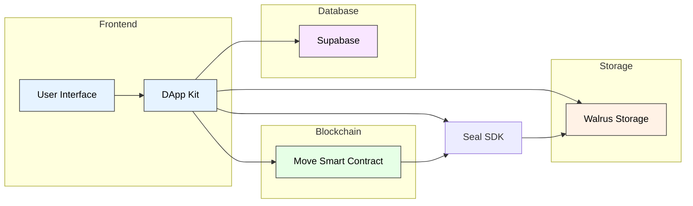

# Tidal - Decentralized Asset Trading Platform

[](LICENSE)
[](https://sui.io)
[](https://supabase.com)

Tidal is a decentralized platform for trading digital assets built on the Sui blockchain. It provides secure, encrypted storage and trading of digital assets with robust access control mechanisms.

## Table of Contents
- [Features](#features)
- [Architecture](#architecture)
- [Getting Started](#getting-started)
- [Development](#development)
- [Deployment](#deployment)
- [Security](#security)
- [API Documentation](#api-documentation)
- [Contributing](#contributing)
- [License](#license)

## Features

- 🔒 End-to-end encrypted asset storage
- 💰 Secure payment processing on Sui blockchain
- 🔐 Robust access control through allowlists
- 📦 Decentralized file storage with Walrus
- 🔑 Multi-server key management
- 📱 Modern, responsive user interface
- 🔄 Real-time updates and notifications

## Architecture



### Core Components

#### 1. Smart Contract Layer (Move)
- **Purpose**: Handles core business logic, ownership, and access control
- **Key Features**:
  - Asset ownership management
  - Access control through allowlists
  - Payment processing
  - Subscription management
- **Integration Points**:
  - Interacts with Seal SDK for access control
  - Manages on-chain state for assets
  - Handles payment transactions

#### 2. Storage Layer (Walrus)
- **Purpose**: Secure, decentralized file storage
- **Key Features**:
  - Encrypted file storage
  - Blob management
  - Content addressing
- **Integration Points**:
  - Receives encrypted files from Seal SDK
  - Provides storage URLs for frontend access
  - Integrates with multiple storage providers for redundancy

#### 3. Encryption Layer (Seal)
- **Purpose**: End-to-end encryption and access control
- **Key Features**:
  - File encryption/decryption
  - Key management
  - Access control verification
- **Integration Points**:
  - Encrypts files before Walrus storage
  - Verifies access rights for decryption
  - Manages session keys for authorized access

#### 4. Database Layer (Supabase)
- **Purpose**: Metadata management and user data storage
- **Key Features**:
  - Asset metadata storage
  - User purchase history
  - File references
  - User management
- **Integration Points**:
  - Stores references to on-chain assets
  - Maintains user purchase records
  - Manages file metadata

## Getting Started

### Prerequisites
- Node.js (v18 or higher)
- Sui CLI
- Supabase account
- Access to key servers

### Installation

1. Clone the repository:
   ```bash
   git clone https://github.com/your-org/tidal.git
   cd tidal
   ```

2. Install dependencies:
   ```bash
   pnpm install
   ```

3. Set up environment variables:
   ```bash
   cp .env.example .env
   # Edit .env with your configuration
   ```

4. Start the development server:
   ```bash
   pnpm dev
   ```

### Configuration

Create a `.env` file with the following variables:
```env
SUI_NETWORK=testnet
SUPABASE_URL=your_supabase_url
SUPABASE_ANON_KEY=your_supabase_key
WALRUS_API_KEY=your_walrus_key
SEAL_API_KEY=your_seal_key
```

## Supabase Setup

### 1. Create a Supabase Project

1. Go to [Supabase](https://supabase.com) and sign in
2. Click "New Project"
3. Fill in the project details:
   - Name: `tidal`
   - Database Password: (create a secure password)
   - Region: (choose closest to your users)
4. Click "Create new project"

### 2. Database Setup

1. Login to supabase from your console
  ```bash
  supabase login
  ```

2. Link your project to supabase 
  ```bash
    supabase link --project-ref <project_ref>
  ```

3. Rund the migration scripts
  ```bash
    supabase db push
  ```

The migrations will:
- Create the assets and purchases tables
- Set up Row Level Security (RLS) policies
- Configure automatic timestamp updates
- Set up necessary indexes and constraints

### 3. Storage Setup

1. Go to Storage in your Supabase dashboard
2. Create a new bucket called `assets`
3. Set the bucket's privacy settings:
   - Public bucket: Yes
   - File size limit: 100MB
   - Allowed mime types: `image/*,video/*,application/*`

### 4. Authentication Setup

1. Go to Authentication > Settings
2. Enable Email auth provider
3. Configure your site URL
4. (Optional) Configure additional auth providers

### 5. Environment Variables

Update your `.env` file with the Supabase credentials:
```env
VITE_SUPABASE_URL=your_project_url
VITE_SUPABASE_ANON_KEY=your_anon_key
```

You can find these values in:
- Project Settings > API
- Project URL: `https://<project-id>.supabase.co`
- anon/public key: `eyJ...` (starts with eyJ)

### 6. Initialize Supabase Client

Create `frontend/src/utils/supabase.ts`:
```typescript
import { createClient } from '@supabase/supabase-js';

const supabaseUrl = import.meta.env.VITE_SUPABASE_URL;
const supabaseAnonKey = import.meta.env.VITE_SUPABASE_ANON_KEY;

export const supabase = createClient(supabaseUrl, supabaseAnonKey);
```

## Development

### Project Structure
```
tidal/
├── frontend/          # React frontend application
├── move/              # Move smart contracts

```

### Available Scripts
- `pnpm dev` - Start development server
- `pnpm build` - Build for production
- `pnpm test` - Run tests
- `pnpm lint` - Run linter
- `pnpm format` - Format code

### Testing
```bash
# Run all tests
pnpm test
```

## Deployment

### Smart Contract Deployment

1. **Build the Contract**
   ```bash
   cd contracts
   sui move build
   ```

2. **Deploy to Testnet**
   ```bash
   # Make sure you have enough SUI for deployment
   sui client gas
   
   # Deploy the contract
   sui client publish --gas-budget 100000000
   ```

3. **Save Contract Details**
   After deployment, save the following information:
   - Package ID

4. **Update Frontend Configuration**
   Create or update `frontend/src/networkConfig.ts`:
   ```typescript
   export const networkConfig = {
    testnet: {
     url: getFullnodeUrl('testnet'),
     variables: {
       packageId: TESTNET_PACKAGE_ID,
       gqlClient: 'https://sui-testnet.mystenlabs.com/graphql',
     },
    },
   };
   ```

## Security

### Access Control
- On-chain allowlists
- Encrypted storage
- Session-based access
- Key server redundancy

### Data Protection
- End-to-end encryption
- Secure key management
- Access verification
- Data integrity checks

### Security Best Practices
1. Always use HTTPS
2. Implement rate limiting
3. Regular security audits
4. Keep dependencies updated
5. Follow the principle of least privilege

## Contributing

1. Fork the repository
2. Create your feature branch (`git checkout -b feature/amazing-feature`)
3. Commit your changes (`git commit -m 'Add amazing feature'`)
4. Push to the branch (`git push origin feature/amazing-feature`)
5. Open a Pull Request

### Code Style
- Follow the existing code style
- Use TypeScript for type safety
- Write meaningful commit messages
- Include tests for new features

## License

This project is licensed under the Apache License 2.0 - see the [LICENSE](LICENSE) file for details.

## Support

For support, please:
1. Check the [documentation](docs/)
2. Open an issue
3. Contact the maintainers

## Acknowledgments

- [Sui Blockchain](https://sui.io)
- [Supabase](https://supabase.com)
- [Seal SDK](https://github.com/mystenlabs/seal)
- [Walrus SDK](https://github.com/mystenlabs/walrus)
