# Tidal - Decentralized Asset Trading Platform

Tidal is a decentralized platform for trading digital assets built on the Sui blockchain. It provides secure, encrypted storage and trading of digital assets with robust access control mechanisms.

## Architecture Overview

```mermaid
graph TB
    subgraph "Frontend Layer"
        UI[User Interface]
        React[React Application]
        DAppKit[DApp Kit]
    end

    subgraph "Blockchain Layer"
        Move[Move Smart Contract]
        Allowlist[Allowlist Object]
        Capability[Capability Object]
    end

    subgraph "Storage Layer"
        Walrus[Walrus Storage]
        Blob[Blob Storage]
        StorageProviders[Storage Providers]
    end

    subgraph "Encryption Layer"
        Seal[Seal SDK]
        KeyServers[Key Servers]
        SessionKey[Session Key Management]
    end

    subgraph "Database Layer"
        Supabase[Supabase]
        Metadata[Asset Metadata]
        Purchases[Purchase Records]
        Users[User Data]
    end

    %% Frontend Interactions
    UI --> React
    React --> DAppKit
    DAppKit --> Move
    DAppKit --> Seal
    DAppKit --> Walrus
    DAppKit --> Supabase

    %% Blockchain Interactions
    Move --> Allowlist
    Move --> Capability
    Move --> Seal

    %% Storage Interactions
    Walrus --> Blob
    Walrus --> StorageProviders
    Seal --> Walrus

    %% Encryption Interactions
    Seal --> KeyServers
    Seal --> SessionKey
    KeyServers --> SessionKey

    %% Database Interactions
    Supabase --> Metadata
    Supabase --> Purchases
    Supabase --> Users

    %% Data Flow for Asset Creation
    subgraph "Asset Creation Flow"
        direction LR
        A1[1. File Upload] --> A2[2. Encryption]
        A2 --> A3[3. Storage]
        A3 --> A4[4. On-chain Registration]
        A4 --> A5[5. Metadata Storage]
    end

    %% Data Flow for Asset Purchase
    subgraph "Asset Purchase Flow"
        direction LR
        P1[1. Purchase Initiation] --> P2[2. Payment Processing]
        P2 --> P3[3. Access Control]
        P3 --> P4[4. Asset Retrieval]
        P4 --> P5[5. Decryption]
    end

    %% Styling
    classDef frontend fill:#f9f,stroke:#333,stroke-width:2px
    classDef blockchain fill:#bbf,stroke:#333,stroke-width:2px
    classDef storage fill:#bfb,stroke:#333,stroke-width:2px
    classDef encryption fill:#fbb,stroke:#333,stroke-width:2px
    classDef database fill:#fbf,stroke:#333,stroke-width:2px
    classDef flow fill:#ddd,stroke:#333,stroke-width:1px

    class UI,React,DAppKit frontend
    class Move,Allowlist,Capability blockchain
    class Walrus,Blob,StorageProviders storage
    class Seal,KeyServers,SessionKey encryption
    class Supabase,Metadata,Purchases,Users database
    class A1,A2,A3,A4,A5,P1,P2,P3,P4,P5 flow
```



### Core Components

#### 1. Smart Contract Layer (Move)
- **Purpose**: Handles core business logic, ownership, and access control
- **Key Features**:
  - Asset ownership management
  - Access control through allowlists
  - Payment processing
  - Subscription management
- **Integration Points**:
  - Interacts with Seal SDK for access control
  - Manages on-chain state for assets
  - Handles payment transactions

#### 2. Storage Layer (Walrus)
- **Purpose**: Secure, decentralized file storage
- **Key Features**:
  - Encrypted file storage
  - Blob management
  - Content addressing
- **Integration Points**:
  - Receives encrypted files from Seal SDK
  - Provides storage URLs for frontend access
  - Integrates with multiple storage providers for redundancy

#### 3. Encryption Layer (Seal)
- **Purpose**: End-to-end encryption and access control
- **Key Features**:
  - File encryption/decryption
  - Key management
  - Access control verification
- **Integration Points**:
  - Encrypts files before Walrus storage
  - Verifies access rights for decryption
  - Manages session keys for authorized access

#### 4. Database Layer (Supabase)
- **Purpose**: Metadata management and user data storage
- **Key Features**:
  - Asset metadata storage
  - User purchase history
  - File references
  - User management
- **Integration Points**:
  - Stores references to on-chain assets
  - Maintains user purchase records
  - Manages file metadata

### Data Flow

#### Asset Creation Flow
1. **File Upload & Encryption**
   ```
   User -> Frontend -> Seal SDK (Encryption) -> Walrus Storage
   ```

2. **On-chain Registration**
   ```
   Frontend -> Move Contract (Create Asset) -> Allowlist Creation
   ```

3. **Metadata Storage**
   ```
   Frontend -> Supabase (Store Metadata) -> Asset Registration Complete
   ```

#### Asset Purchase Flow
1. **Purchase Initiation**
   ```
   User -> Frontend -> Move Contract (Payment) -> Allowlist Update
   ```

2. **Access Control**
   ```
   Frontend -> Seal SDK (Verify Access) -> Session Key Generation
   ```

3. **Asset Retrieval**
   ```
   Frontend -> Walrus Storage (Get File) -> Seal SDK (Decrypt) -> User
   ```

### Security Architecture

#### Encryption & Access Control
- Files are encrypted before storage
- Access is controlled through on-chain allowlists
- Decryption requires valid session keys
- Multiple key servers ensure redundancy

#### Storage Security
- Encrypted storage in Walrus
- Content addressing for integrity
- Multiple storage providers for redundancy
- Access control at both storage and blockchain levels


## Technical Requirements

### Dependencies
- Sui Blockchain
- Seal SDK
- Walrus SDK
- Supabase
- React (Frontend)

### Environment Setup
- Sui node access
- Supabase instance
- Key server access
- Storage provider credentials

## Development

### Local Development
1. Set up Sui development environment
2. Configure Supabase instance
3. Set up key server access
4. Configure storage providers


## Security Considerations

### Access Control
- On-chain allowlists
- Encrypted storage
- Session-based access
- Key server redundancy

### Data Protection
- End-to-end encryption
- Secure key management
- Access verification
- Data integrity checks
